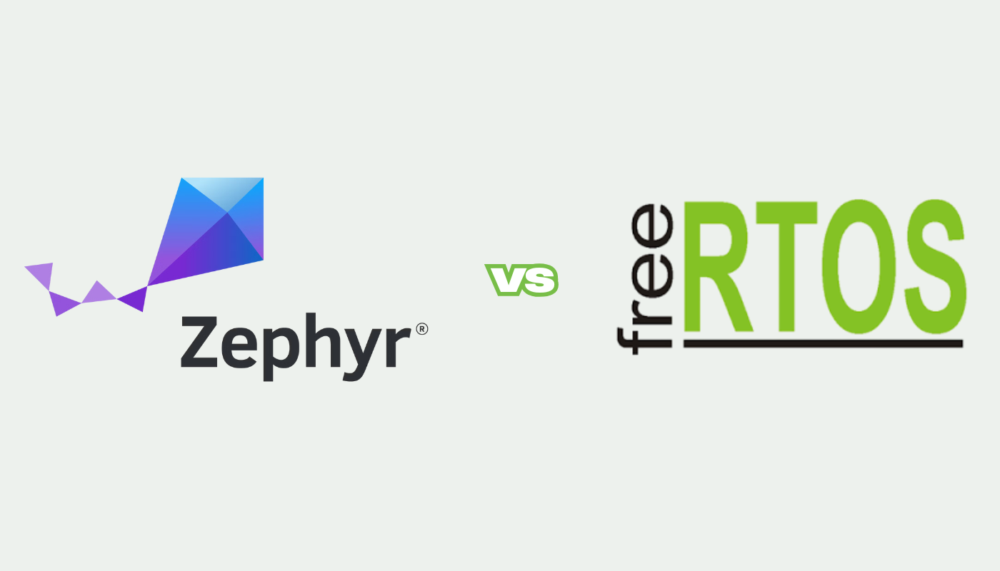
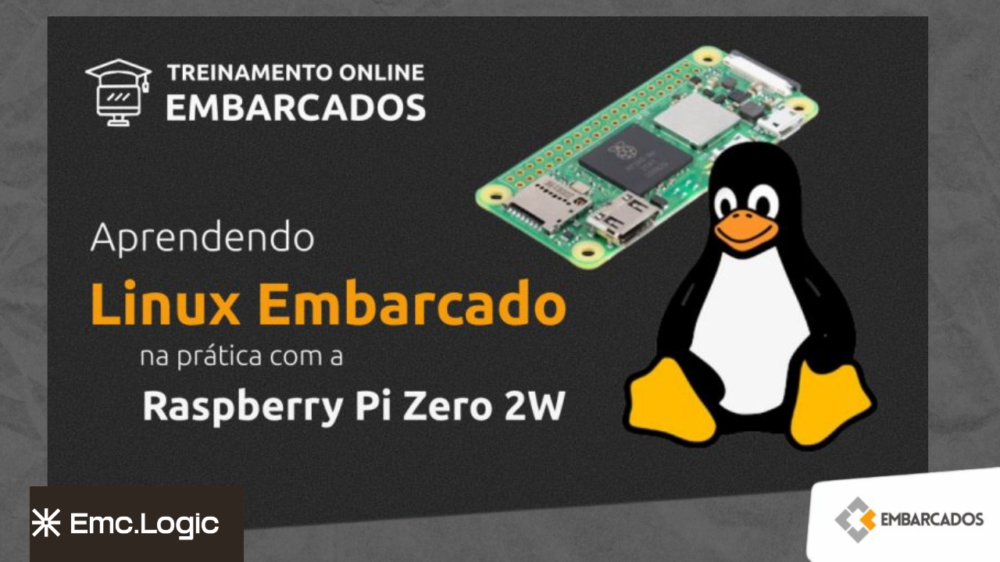

## Fique por dentro de todas nossas novidades e notícias

## [Zephyr vs FreeRTOS: comparação de portabilidade e desempenho](https://www.emc-logic.com/zephyr-vs-freertos-comparacao-de-portabilidade-e-desempenho/ "Zephyr vs FreeRTOS: comparação de portabilidade e desempenho")

Em Fevereiro desse ano a AMD postou um guia oficial...

[Leia mais](https://www.emc-logic.com/zephyr-vs-freertos-comparacao-de-portabilidade-e-desempenho/) [Bruna Jacomelli](https://www.emc-logic.com/author/bruna-jacomelli/ "Posts de Bruna Jacomelli")28 de fevereiro de 2025

## [Linux em Sistemas de Missão Crítica: Project ELISA](https://www.emc-logic.com/linux-em-sistemas-de-missao-critica-o-projeto-elisa/ "Linux em Sistemas de Missão Crítica: Project ELISA")

Já é de conhecimento geral que o Linux traz caracteristicas...

[Leia mais](https://www.emc-logic.com/linux-em-sistemas-de-missao-critica-o-projeto-elisa/) [Bruna Jacomelli](https://www.emc-logic.com/author/bruna-jacomelli/ "Posts de Bruna Jacomelli")15 de fevereiro de 2025

## [Licença GPL e seu impacto na comunidade Open Source](https://www.emc-logic.com/entendendo-a-licenca-gpl-e-seu-impacto-no-linux-embarcado-e-na-comunidade-open-source/ "Licença GPL e seu impacto na comunidade Open Source")

Quem trabalha com Linux Embarcado (ou que gosta de programação...

[Leia mais](https://www.emc-logic.com/entendendo-a-licenca-gpl-e-seu-impacto-no-linux-embarcado-e-na-comunidade-open-source/) [Bruna Jacomelli](https://www.emc-logic.com/author/bruna-jacomelli/ "Posts de Bruna Jacomelli")1 de fevereiro de 2025

## [\[Curso\] – Aprendendo Linux Embarcado utilizando a Raspberry Pi Zero 2W.](https://www.emc-logic.com/curso-linux-embarcado-2024/ "[Curso] – Aprendendo Linux Embarcado utilizando a Raspberry Pi Zero 2W.")

Em parceria com o portal http://www.embarcados.com.br desenvolvemos o curso com...

[Leia mais](https://www.emc-logic.com/curso-linux-embarcado-2024/) [Fernando Luiz Cola](https://www.emc-logic.com/author/fernando-luiz-cola/ "Posts de Fernando Luiz Cola")12 de agosto de 2024

Carregar mais
