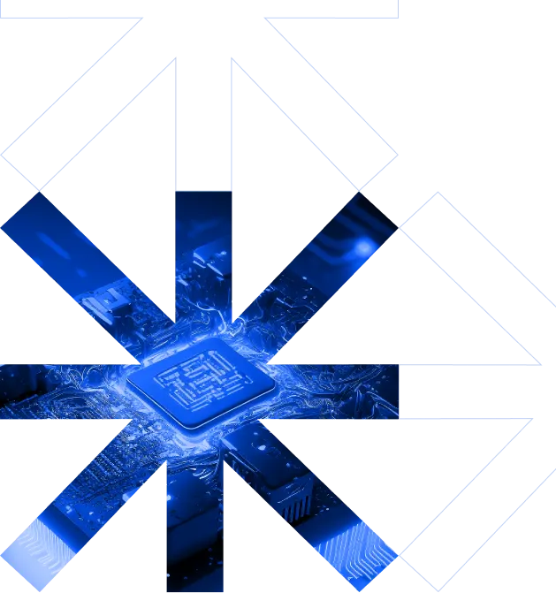
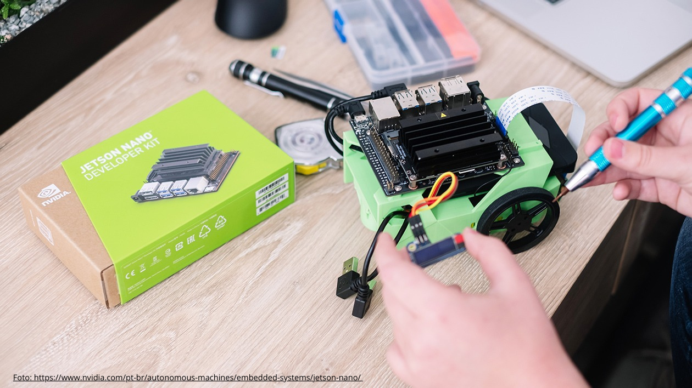
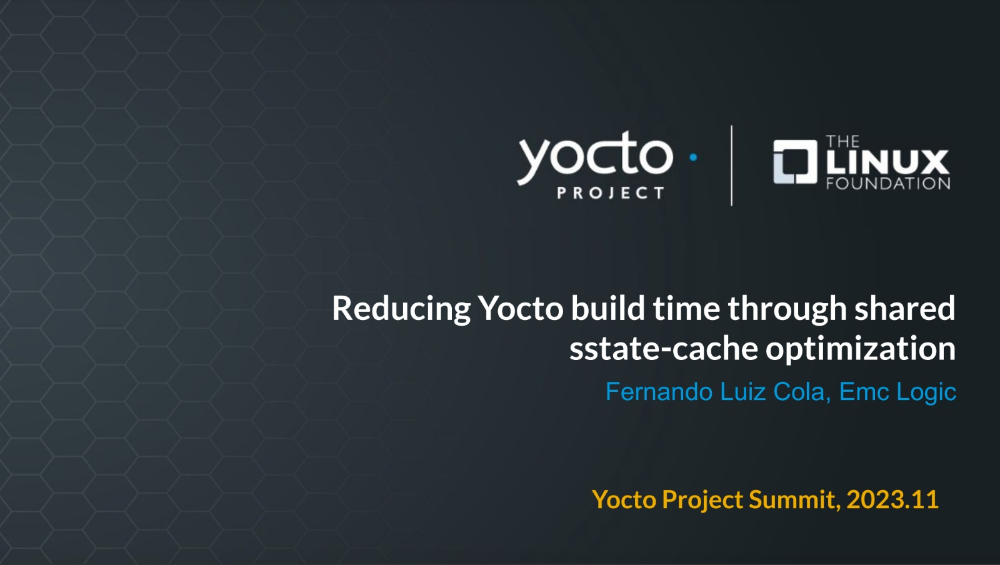

 

# Making Feasible Embedded Technologies

Offering consulting, training, and embedded software development to bring your project to fruition. [Explore Our Services](#servicos)

## Customers and Partners who trust in our services

                 

## About us

Our company was founded 7 years ago and we provide consulting, training, and software development services for microcontrolled and microprocessed Embedded Systems.

Our objective is to achieve a fast time-to-market for embedded devices by embracing the best development practices while migrating projects to the latest open-source solutions. We're always here to assist our clients in finding solutions that are efficient, optimized, safe and cost-effective.

[Contact us](#contato) 

## Our services

## Software Development for Embedded Linux

For devices that require rich interfaces, high connectivity, gateways, and need for peripheral integration

- Customization and optimization of images.
- Development of graphical interfaces for displays.
- Boot time optimization.
- Development of Board Support Packages (BSPs) and drivers.
- Modification and configuration of Device-Tree.
- Setting up the cross-compilation and programming environment.
- Initialization of applications by Systemd and SysVinit.

## Firmware Development for Microcontrollers

For devices that require real-time responses and low power consumption:

- Support for STM32, Nordic, NXP, ESP32 microcontrollers.
- Development of solutions without Baremetal or RTOS.
- Reduction of memory footprint and optimization of power consumption.
- Development of device drivers and libraries.
- Configuration of peripherals such as UART, I2C, PWM, GPIO, DMA, ADC, USB, and CAN.
- Development with abstraction layers - HAL.
- Static code analyzers and unit tests.
- Code versioning and secure deployment.

## Consulting and Training on demand

To provide guidance and training for your team in finding development strategies aligned with market needs." Consulting for your project:

- Analysis of the best hardware architecture
- Selection of the best tools and technologies
- Strategies for fast and secure Embedded Software development.

Training:

- Options for Online or On-site training
- Content customized to the team's needs
- Topics ranging from basic to advanced: Embedded Linux Software Development and Yocto Project
- Hands-on Methodology

## Key technologies

     

## Areas of expertise

[Contact us](#contato) 

### Industry Automation

### Agricultural Technologies

### Medical and Laboratory Equipment

### Access Control and Security

### Trainings

### Internet of Things (IoT)

### Industry Automation

### Agricultural Technologies

### Medical and Laboratory Equipment

### Access Control and Security

### Trainings

### Internet of Things (IoT)

## Check out our insights

- All Posts
- Blog

14:39

## [Habilitando SPI no Jetson Nano Developer Kit](https://www.emc-logic.com/habilitando-spi-no-jetson-nano-developer-kit/)

Há uns dias, estávamos tentando fazer um teste simples com a SPI de uma Jetson Nano Developer Kit versão B01…

[Ler mais](https://www.emc-logic.com/habilitando-spi-no-jetson-nano-developer-kit/)

18:24

## [Yocto Project Virtual Summit 2023: Reduzindo o tempo de build](https://www.emc-logic.com/reduzindo-o-tempo-de-build-no-yocto-project-atraves-de-compartilhamento-de-otimizacoes-do-sstate-cache/)

No Yocto Project Virtual Summit, organizado Linux Foundation, você encontra palestras e talks com temas relevantes e atuais sobre o…

[Ler mais](https://www.emc-logic.com/reduzindo-o-tempo-de-build-no-yocto-project-atraves-de-compartilhamento-de-otimizacoes-do-sstate-cache/)

[Go to all insights](#)

## Contact Us

Itápolis/SP - Brazil  
**Phone:** +55 (16) 9 3618-1941

**WhatsApp:** [+55 (16) 9 3618-1941](https://wa.me/5516936181941)  
**E-mail:** [contato@emc-logic.com](mailto:contato@emc-logic.com)

Ative o JavaScript no seu navegador para preencher este formulário.

Ative o JavaScript no seu navegador para preencher este formulário.Name \*CompanyPhoneE-mail \*Message  Send
