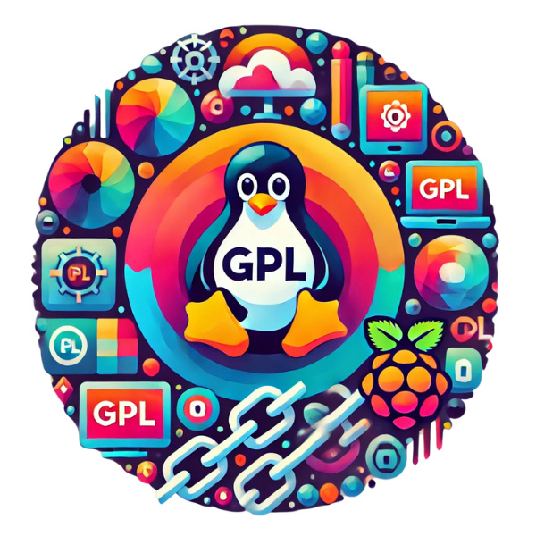

Quem trabalha com Linux Embarcado (ou que gosta de programação e tecnologia no geral) se depara diariamente com Softwares e códigos que estão sob a licença GPL. E nesse artigo trazemos informações sobre a GPL e seu impacto.

## **Um pouco sobre a história**

Criada na década de 80 por Richard Stallman (criador do movimento Software Livre - que é diferente do movimento Open Source), a GNU General Public License (GPL) trouxe parâmetros para a utilização e distribuição de softwares com código aberto. Conforme explicado pelo proprio site do Free Software Movement (em tradução livre):

_" A GPL (GNU General Public License), criada por Richard Stallman, serve como a constituição de facto do movimento de Software Livre. Ela cobre a maioria dos Softwares Livres e Softwares Open Source e se tornou o fundamento legal e filosófico para a comunidade do Software Livre"_ \[1\]

Ela trouxe, então, um conjunto de diretrizes que impactaram não somente o movimento do Software Livre, mas também a comunidade Open Source como um todo.  
Se fossemos resumir os principais pontos trazidos pela GLPv1 (1989) ao lidar com a propriedade intelectual de um software, eles seriam:  
\- dado um código aberto, usuários podem utilizar e compilar o mesmo sem restrições, até mesmo para a comercialização  
\- o usuário pode modificar ou adaptar o código de acordo com suas necessidades  
\- caso seja feita alguma modificação ou melhoria do código, essas mudanças devem estar abertas para a comunidade  
\- qualquer usuário pode distribuir o software desde que o faça dentro dos termos da licença

A criação da GPL acabou se tornando um divisor de águas no licenciamento de softwares. Já haviam, antes dela, outras diretrizes, mas não tão formalizadas e abrangentes, e muito menos focadas em códigos livres.

## **Sobre a Licença GPL e suas versões**

Existem diversas versões da GPL. A versão 1 foi bem embrionária, trazendo as ideias mais fundamentais e introduzindo o conceito de Copyleft, um ponto muito importante em suas diretrizes.

O Copyleft determina que, ao utilizar um código que está sob licença GPL e modificá-lo, a versão derivada deve permanecer aberta e ser distribuida sob os mesmos termos. Além disso, teve como objetivo também incentivar programadores que se utilizam de softwares livres a contribuirem para a comunidade.

A Versão 2 (GPLv2) foi aprimorada e trouxe definições mais precisas. Também expandiu os termos de Copyleft e trouxe a obrigação de fornecer o código-fonte junto com qualquer distribuição de binário. Mesmo lançada em 1991, ela ainda é frequentemente utilizada. O próprio kernel Linux ainda utiliza a GPLv2, assim como o Busybox, o QEMU, o Git e até mesmo o reprodutor de mídias VLC e o Wordpress. É uma licença consolidada, estável e com termos mais diretos e mais compatíveis com projetos legados.

A versão 3 (GPLv3), lançada em 2007, é a mais atual. Ao contrário das versões anteriores, onde a integração com outras licenças open source é inviável, a GPLv3 permite uma integração com outras licenças open source, desde que no final se torne uma única licença GPLv3 (um efeito viral, já que ela se utiliza dessa compatibilidade para _contagiar_ o projeto final com seus termos e diretrizes). Ela também introduz regras mais claras sobre questões de patentes e outras cláusulas mais rigorosas, como por exemplo sua tentativa de combater o que foi chamado de _tivoization_ (termo baseado no equipamento TiVo, que nunca chegou ao Brasil).  
Tivoization é um termo que define a prática de criar dispositivos que rodam um software com licença Copyleft ou GPL, mas que mantém restrições no Hardware de maneira que o usuário não consegue modificar o software dentro dele. Portanto, a GPLv3 exige que os fabricantes forneçam as informações de instalação necessárias para impedir que o hardware bloqueie alterações no software.  
É uma versão que gerou bastante controvérsia, sendo inclusive [criticada por Linus Torvalds](https://www.youtube.com/watch?v=PaKIZ7gJlRU), o criador do Linux.

Temos também a GNU Lesser General Public License, atualmente na versão LGPLv3, que é uma versão relativamente mais permissiva, que permite agregar o código aberto em aplicações proprietárias sem exigir que o software completo seja distribuído sob os termos da GPL desde que alguns critérios sejam seguidos.

## **Aplicações da GPL no desenvolvimento de Linux Embarcado**

Como dito anteriormente, o próprio Kernel Linux é licenciado sob a GPLv2, assim como muitos drivers. Isso exige atenção para com o tipo de projeto que está sendo desenvolvido. Se o projeto inclui código proprietário, por exemplo, é muito importante se atentar a como ele vai interagir com os componentes que estão sob a GPL.  
Ao trabalhar com Yocto Project, por exemplo, devemos nos atentar também para com as receitas e bibliotecas que podem carregar GPL.  
O Qt, também muito utilizado no desenvolvimento embarcado, adota um modelo de licenciamento complexo e oferece versões sob LGPL e GPLv3, mas também sob sua licença comercial. O que exige do programador um cuidado especial durante o desenvolvimento. As licenças do Qt são um assunto que exige um artigo somente para ele.

Também criamos, em nosso canal, um video explicando esse assunto. Confira:

https://www.youtube.com/watch?v=\_sL6g6UkHiQ&t=76s

Fontes:  
\[1\] [The History of the GPL](https://www.free-soft.org/gpl_history/)  
\[2\] [Copyleft e versões da GPL](https://copyleft.org/guide/comprehensive-gpl-guidech3.html)  
\[3\] [O que é Copyleft?](https://www.gnu.org/licenses/copyleft.en.html)  
\[4\] [GPLv2](https://www.gnu.org/licenses/old-licenses/gpl-2.0.html)  
\[5\] [GPLv3](https://www.gnu.org/licenses/gpl-3.0.html)  
\[6\] [LGPLv3](https://www.gnu.org/licenses/lgpl-3.0.en.html)
