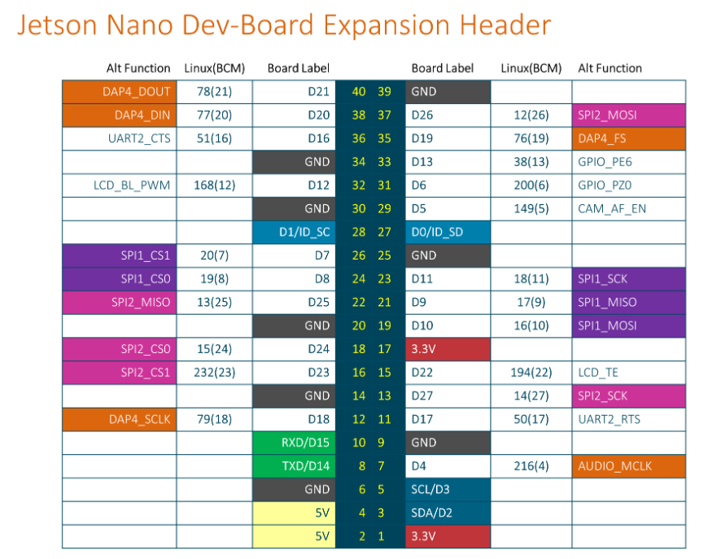

Há uns dias, estávamos tentando fazer um teste simples com a SPI de uma Jetson Nano Developer Kit versão B01 e ficamos surpresos com o tempo que levou para descobrir o que era preciso para habilitá-la.  
Já que não haviam muitos tutoriais na internet para auxiliar, resolvi escrever esse pequeno guia de como habilitar essa interface.  
  
Para começar a usar a Jetson Nano nós gravamos a imagem do Ubuntu disponibilizada pela própria NVIDIA. Para você gravar essa imagem na sua Jetson e configurá-la basta seguir o passo a passo disponibilizado pela própria fabricante [aqui](https://developer.nvidia.com/embedded/learn/get-started-jetson-nano-devkit). Porém, depois de toda essa saga, fica aqui a minha recomendação: gere a sua própria imagem com o [Yocto Project usando a camada meta-tegra](https://developer.ridgerun.com/wiki/index.php/Yocto_Support_for_NVIDIA_Jetson_Platforms_-_Setting_up_Yocto).

No teste da SPI utilizamos uma ferramenta chamada spidev\_test. Para usá-la na Jetson basta fazer o download do código fonte e usar o gcc para compilar:

```
$ wget https://raw.githubusercontent.com/torvalds/linux/v4.9/tools/spi/spidev_test.c$ gcc -o spidev_test spidev_test.c
```

Para os testes, queríamos utilizar o SPI1. 
Pelo pinout da placa na figura abaixo, temos que o pino 19 do header é o MOSI e o pino 21 o MISO, então colocamos um jumper entre os dois para fazer um teste de loopback.



Depois, carregamos o driver e executamos o teste:

```
sudo modprobe spidevsudo ./spidev_test -D /dev/spidev0.0 -v -p "Hello, World!"
```

Como o mosi e o miso estão conectados, se o teste de loopback desse certo, o "Hello, World!" deveria ser enviado e também recebido pela interface spidev0.0. No nosso caso, mesmo seguindo todas as recomendações da NVIDIA, o teste de loopback não funcionava. Então, encontramos esse [post](https://forums.developer.nvidia.com/t/spi-setup-issues-with-jetson-nano-b01-devkit/267095/129) no fórum. De maneira resumida, só é possível habilitar a SPI nesse kit fazendo alterações na device tree da flash do módulo.  
Portanto, modificar a device tree na imagem do SD Card não funciona.  
  
Neste post, a solução proposta foi utilizar uma ferramenta disponibilizada pela NVIDIA, o SDK Manager. Como essa ferramenta é muito obscura (você precisa de um host rodando um Ubuntu em uma versão específica para funcionar), nós resolvemos o problema de outra maneira:  
  
1) Primeiro, é preciso compilar a device-tree com as modificações necessárias. Para esse hardware precisamos recompilar a tegra210-p3448-0000-p3449-0000-b00.dts e para isso é necessário aplicar as modificações deste [patch](https://emclogic2017-my.sharepoint.com/:u:/g/personal/brenda_jacomelli_emc-logic_com/Efd5tnWANxdPjq6PNqUJ6GUB32IVQbtjaQnnn7Z8C4Iuqg?e=5Q5DYi) no [linux tegra](https://github.com/OE4T/linux-tegra-4.9/tree/oe4t-patches-l4t-r32.7.4) e compilar o novo binário de device tree (tegra210-p3448-0000-p3449-0000-b00.dtb).  
Existem algumas maneiras de fazer isso: via cross-compilação (baixando o compilador da jetson no seu HOST) ou o método preguiçoso: compilando dentro da própria jetson nano.

  
2) Depois, deve-se colocar a jetson em Recovery Mode. Para isso, coloca-se um jumper entre os pinos 10 e 9 (FORCE\_RECOVERY e GND) do header de pinos J50, conecta-se a porta USB do seu computador na porta Micro-USB do kit e liga-se a placa. Neste caso, a placa deve ser alimentada via fonte DC no conector J25. Por isso, é importante se atentar aos jumpers de alimentação do kit.

  
3) Enfim, neste passo, você vai precisar de uma imagem tegraflash gerada pelo Yocto. Se você quiser gerar a sua própria, basta usar a camada meta-tegra que linkamos acima. Caso não, temos uma imagem mínima compactada [aqui](https://emclogic2017-my.sharepoint.com/personal/fernando_cola_emc-logic_com/_layouts/15/onedrive.aspx?id=%2Fpersonal%2Ffernando%5Fcola%5Femc%2Dlogic%5Fcom%2FDocuments%2Fcore%2Dimage%2Dminimal%2Djetson%2Dnano%2Ddevkit%2D20231107175247%2Etegraflash%2Etar%2Egz&parent=%2Fpersonal%2Ffernando%5Fcola%5Femc%2Dlogic%5Fcom%2FDocuments&ct=1707401326989&or=Teams%2DHL&ga=1) para você utilizar.  
Extraia ela e mude o arquivo dtb por aquele que você gerou com as modificações da SPI (nós substituímos a dtb tegra210-p3448-0000-p3449-0000-b00.dtb)

4) Finalmente, basta rodar o script para regravar a flash do módulo:

```
sudo ./doflash.sh --spi-only
```

Por fim, ao seguir esses passos e carregar o módulo do driver spidev, seu teste de loopback e outras aplicações com essa interface funcionarão corretamente. Aqui funcionou como o esperado. Espero que consiga habilitar a SPI em sua Jetson Nano! :)

Esse artigo está licenciado com uma [Licença Creative Commons Attribution-ShareAlike 4.0 International](https://creativecommons.org/licenses/by-sa/4.0/)


[  
Voltar  
](https://www.emc-logic.com/)
