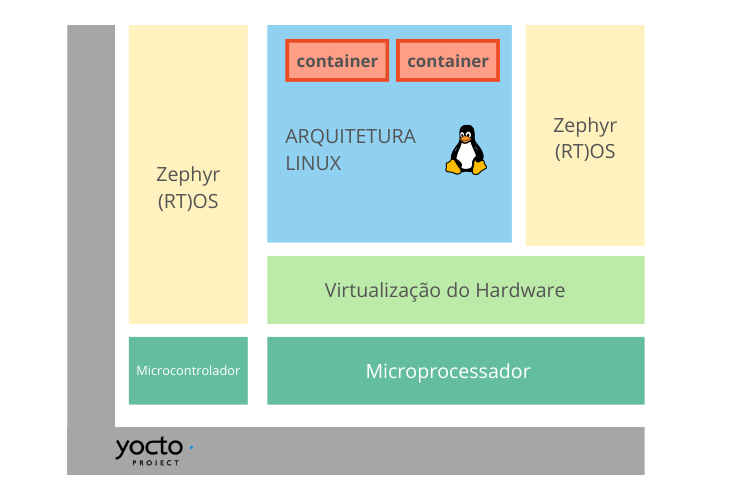
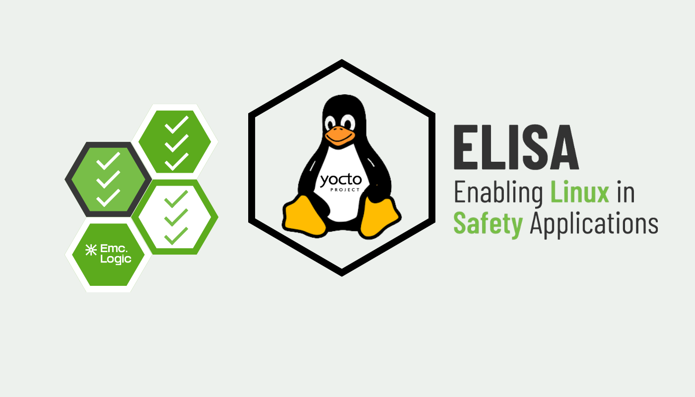

Já é de conhecimento geral que o Linux traz caracteristicas que o tornam o melhor sistema operacional para desenvolver projetos Embarcados. Ele é altamente modulável e contém uma comunidade ativa que permite que um usuário ou um time consiga desenvolver aquilo que é necessário no momento, criando um sistema personalizável. Porém essas mesmas qualidades podem ser também um problema quando estamos tratando de Sistemas de missão crítica, que devem seguir regras e normas rídigidas para seu funcionamento e é nesse contexto que entra o ELISA Project.

Afinal, crescente complexidade dos sistemas embarcados aumenta a necessidade de segurança e confiabilidade. Para garantir conformidade com padrões como IEC e ISO, soluções de código aberto enfrentam desafios na criação de _SBOMs_ (Software Bill of Materials) e no cumprimento de diretrizes de segurança.

## Segurança e Padrões

Como desenvolvedor, imagine o seguinte cenário: você faz parte do time responsável por desenvolver o sistema operacional de um ventilador pulmonar automático, por exemplo. Ele deve regular a respiração e emitir alarmes em caso de falhas. Parece simples.  
Mas, ocorre um bug no software (porque sempre vai ter um bug no software em algum momento) onde o fluxo de ar fica irregular por algum problema no tubo respiratório. Sem um mecanismo de monitoramento confiável, pode ser que o alarme de emergência não apite, os parâmetros da ventilação não se ajustam como consequência e a equipe médica não é informada que há algo errado e o paciente não está recebendo oxigênio o suficiente.

Esse é apenas um exemplo, mas existem inúmeros casos onde erros pequenos podem ocorrer e trazer prolemas gigantescos. Por mais que nossos sitemas sejam desenvolvidos da melhor maneira possível e com inúmeras validações da equipe, há muitas variáveis a serem gerenciadas. Como consequência, a probabilidade de erros (seja eles no hardware ou no software) se torna cada vez mais significante.

Precisamos, então, tentar antecipar esses erros potenciais ou ao menos fortificar nossos sistemas. E é nesse ponto onde as diretrizes do projeto ELISA entram em cena.

## O Projeto ELISA

O _ELISA Project_ (Enabling Linux in Safety Applications - _Habilitando Linux em Aplicações Críticas_, em uma tradução livre) foi lançado em 2019 com o objetivo de definir processos, ferramentas e elementos comuns para que sistemas baseados em Linux possam obter certificações de segurança.  
Abaixo, adaptamos um diagrama do [site do ELISA](https://elisa.tech/wp-content/uploads/sites/19/2024/05/ELISA_one_pager_May2024.pdf) que resume um exemplo de arquitetura de referência proposta pelas diretrizes do ELISA para construir de maneira segura Sistemas de Missão Criticas baseados em Linux.

Nesse diagrama, o Yocto Project vem como a fundação por ter reprodutibilidade, suporte da comunidade e total capacidade de lidar com sistemas embarcados complexos.  
As aplicações são, então, separadas no nível do processador, usando sistemas de virutalização dentro do Linux. E como frequentemente as soluções que trabalhamos são microcontroladas, podemos integrar um Sistema Operacional de Tempo Real (RTOS) que nesse caso utilizamos como referência o Zephyr, por ser integrado também ao Linux.

## Aplicações das diretrizes de segurança do ELISA

Retornando ao Exemplo hipotético acima com o ventilador, só que com as diretrizes do ELISA.  
Os sensores de fluxo e pressão estariam acompanhados de um Watchdog.  
Um Watchdog ("cão de guarda") é um mecanismo de segurança que vai ficar monitorando continuamente o fluxo de ar do ventilador. Se ocorrer a irregularidade que falamos acima, os sensores vão detectar a anomalia e o watchdog vai ser acionado. Caso não se regularize, o sistema vai ativar um modo de segurança para tentar conter o problema ou, em casos de problemas mais sérios, acionar a equipe médica e registrar o evento para análise posterior.

## Yocto Virtual Summit 2024.12

Deploying and Testing Fail-Safe Systems with Yocto Project (Implantando e Testando Sistemas à prova de falhas com Yocto Project) foi o tema de nossa apresentação no Yocto Summit 2024. No vídeo abaixo, legendado em português, você encontra informações mais completas sobre o projeto ELISA e acompanha uma demo que vai ilustrar o que foi falado até o momento.  

https://youtu.be/\_sN8kvFLm9o

######   

## LINK

\[1\] [Link oficial do evento](https://tinyurl.com/yoctosummit2024)  
\[2\] [Link do canal oficial do Yocto no Youtube (onde se pode ver na integra todas as palestras):](https://tinyurl.com/canalYoctoProj)  
\[3\] [Link da nossa apresentação (com slides)](https://tinyurl.com/ELISAtalk)
