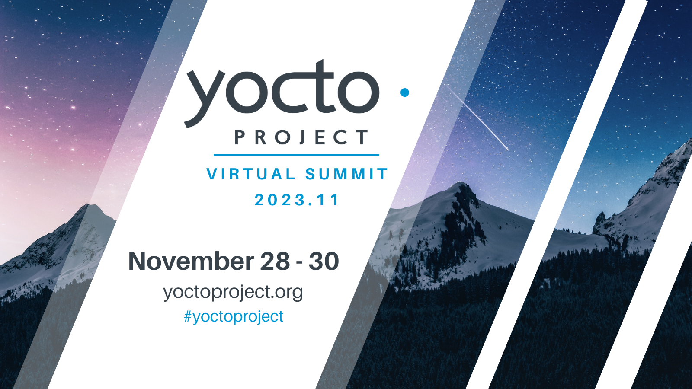

No [Yocto Project Virtual Summit](https://www.yoctoproject.org/event/yocto-project-summit-2023-11/), organizado [Linux Foundation](https://www.linuxfoundation.org/), você encontra palestras e talks com temas relevantes e atuais sobre o assunto. As palestras são direcionadas para todo o tipo de público envolvido com Linux Embarcado, desde engenheiros e programadores da área até entusiastas do assunto.

Participei como palestrante nessa edição de Novembro/23, com a apresentação: _"Reducing Yocto build time through shared sstate-cache optimization"_ ou _"Reduzindo o tempo de Build no Yocto Project através da otimização do sstate-cache compartilhado"_

Portanto, escolhi esse tema para a discussão, uma vez que ao trabalhar com Linux Embarcado, fica claro que o tempo de Build dos projetos é um ponto que afeta muito a fluidez do andamento do projeto, principalmente em times pequenos ou médios. Assim, o objetivo foi dividir o processo em passos simples que possam ajudar seus projetos no Yocto a funcionarem de maneira mais rápida e eficiente, independentemente do tamanho da equipe. Por isso, a palestra busca mostrar como configurar um espaço compartilhado com um servidor HTTP e apresentar o Hash Equivalent Server (OEEquivHash) para construções mais previsíveis e rápidas, utilizando o sstate-cache de forma pragmática.

Acesse o link abaixo para baixar os slides da apresentação:  
[https://bit.ly/47yIYPr](https://bit.ly/47yIYPr)

No link abaixo, você encontra um resumo das palestras de Novembro/2023, juntamente com os slides.  
[https://bit.ly/47yJsVL](https://bit.ly/47yJsVL)

Se você se interessou sobre o assunto, outra palestra dessa mesma edição do Yocto Project Virtual Summit: "_Hash Equivalence at Scale"_ complementa o assunto. No link abaixo você consegue acessar mais informações sobre esse talk:  
[https://bit.ly/3S3BDBp](<https://bit.ly/3S3BDBp >)

Todos os talks estão gravados e você pode encontrá-los no canal do [Youtube do Yocto Project](https://www.youtube.com/@TheYoctoProject).

https://youtu.be/dE1Fargo20U?si=L1gnC6QIwm6-4N7Q

Até a próxima conferência!
